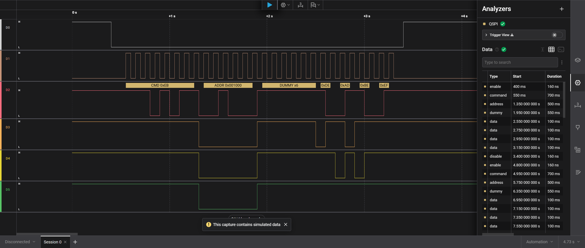

# QSPI Analyzer for Saleae Logic 2

A custom Low-Level Analyzer (LLA) for the Saleae Logic 2 software that decodes Quad SPI (QSPI) traffic — chip select, serial clock, and up to four bidirectional data lines (IO0–IO3), as used by QSPI flash memories (W25Q, MX25, etc.) and similar peripherals.

Built from the [Saleae SampleAnalyzer](https://github.com/saleae/SampleAnalyzer) template against the [Saleae Analyzer SDK](https://github.com/saleae/AnalyzerSDK).



*The analyzer decoding its own simulated traffic in Logic 2 demo mode: `CMD 0xEB → ADDR 0x001000 → DUMMY x6 → DE AD BE EF` bubbles on IO0, with typed frames (`enable`/`command`/`address`/`dummy`/`data`/`disable`) in the data table.*

## Channels

| Signal | Setting | Required |
|--------|---------|----------|
| Chip Select | CS | yes |
| Serial Clock | SCK | yes |
| Data 0 (MOSI / SI) | IO0 | yes |
| Data 1 (MISO / SO) | IO1 | yes |
| Data 2 (WP#) | IO2 | only when a phase uses quad width |
| Data 3 (HOLD# / RESET#) | IO3 | only when a phase uses quad width |

## Settings

| Setting | Options | Notes |
|---------|---------|-------|
| Command Width | Single / Dual / Quad | IO lines used during the command (opcode) phase |
| Address Width | Single / Dual / Quad | IO lines used during the address phase |
| Data Width | Single / Dual / Quad | IO lines used during the data phase |
| Address Bits | none / 8 / 16 / 24 / 32 | 24 is typical for flash ≤ 16 MB; "none" skips the address phase |
| Dummy Cycles | 0–63 | Clock cycles between address and data. Count continuous-read "mode" cycles here too. |
| Clock Polarity (CPOL) | 0 / 1 | Clock idle level |
| Clock Phase (CPHA) | 0 / 1 | Sampling on leading (CPHA=0) or trailing (CPHA=1) clock edge |
| CS Active State | Low / High | Active low is typical |

Each transaction is decoded as **CS assert → Command (8 bits) → Address → Dummy → Data (until CS deassert)**, with each phase read at its configured bus width.

### Bit packing

All values are assembled MSB-first:

- **Quad (QIO)**: one nibble per clock, mapped `IO3:IO2:IO1:IO0` = bits 3:0. First nibble of a byte is the high nibble (2 clocks per byte).
- **Dual (DIO)**: two bits per clock, `IO1:IO0` = bits 1:0 (4 clocks per byte).
- **Single (SIO)**: one bit per clock on IO0. During the data phase both IO0 (command/write lane) and IO1 (response lane) are captured, like a classic SPI MOSI/MISO pair.

### Limitations

- Phase configuration is static per capture — the analyzer does not switch widths per opcode (e.g. mixed `0x03`/`0x6B`/`0xEB` traffic decodes correctly only for the configured shape). A per-command table or a Python HLA layered on this analyzer's FrameV2 output is the natural extension.
- DDR (double data rate) and octal modes are not supported.
- Command-only transactions (e.g. Write Enable `0x06`) decode as a command followed by a truncated-phase error when Address Bits ≠ none, since the analyzer expects the configured phases.

## Output

- **Waveform bubbles** (on IO0): `CMD 0xEB`, `ADDR 0x001000`, `DUMMY x6`, data bytes; arrow markers on each sampled clock edge; error bubbles when CS deasserts mid-phase or the clock is not idle at CS assert.
- **Data table / HLA (FrameV2)**: typed frames `enable`, `command` (`cmd`), `address` (`address`, `bits`), `dummy` (`cycles`), `data` (`data`, or `mosi`/`miso` for single-width), `error` (`error`), `disable` — consumable from Python High-Level Analyzers.
- **CSV export**: `Time [s], Phase, Value, IO1 Value (SIO data only)`.

## Installing from a release

Prebuilt binaries for Windows (x64/ARM64), macOS (x64/ARM64), and Linux (x64/ARM64) are attached to each [GitHub release](https://github.com/stevenpickles/saleae-logic2-qspi-analyzer/releases).

1. Download the archive for your platform and extract it to a folder of your choice.
2. In Logic 2: **Preferences** (gear icon) → **Custom Low Level Analyzers** → set the search path to that folder.
3. Restart Logic 2. "QSPI" appears in the analyzer list.

To build from source instead, see below.

## Building

Requirements: CMake ≥ 3.13, a C++ compiler (Visual Studio 2022 with the C++ workload on Windows), and internet access on first configure (the Analyzer SDK is fetched via CMake FetchContent).

### Windows

```powershell
mkdir build
cd build
cmake .. -A x64
cmake --build . --config Release
# output: build\Analyzers\Release\QuadSpiAnalyzer.dll
```

### macOS / Linux

```bash
mkdir build
cd build
cmake ..
cmake --build .
# output: build/Analyzers/libQuadSpiAnalyzer.so
```

## Installing into Logic 2

1. Open Logic 2 → **Preferences** (gear icon) → **Custom Low Level Analyzers**.
2. Set the search path to this repo's `build\Analyzers\Release` directory (or wherever you copied the built library).
3. Restart Logic 2. "QSPI" now appears in the analyzer list.

Note: Windows locks the DLL while Logic 2 runs — close Logic 2 before rebuilding.

## Testing without hardware

The analyzer includes a simulation data generator. Start a capture in Logic 2's **demo mode** (no device connected) with the QSPI analyzer added, and it will produce repeating transactions of:

```
CMD 0xEB → ADDR 0x001000 → dummy cycles → DE AD BE EF
```

driven by the live analyzer settings, so every width/CPOL/CPHA combination can be verified end-to-end.

## Unit tests

`tests/` contains a self-contained test suite that runs the real decoder and simulation generator against an in-process mock of the Analyzer SDK runtime (`tests/mock_sdk.cpp`) — no Logic 2 installation needed:

- **Golden tests**: hand-authored waveforms written directly from the QSPI spec, asserting exact decoded values and sample positions (ground truth independent of the simulator).
- **Permutation sweep**: closed-loop simulate→decode runs across every combination of per-phase width × address length × dummy cycles × CPOL/CPHA × CS polarity (4,320 permutations).
- **Edge cases**: CS deassert mid-phase (truncation), clock not idle at CS assert, IO2/IO3 unconnected, settings serialization round-trip and validation.

```powershell
cmake --build build --config Release --target qspi_tests
ctest --test-dir build -C Release --output-on-failure
```

Tests build by default; disable with `-DQSPI_BUILD_TESTS=OFF`. CI runs them on every platform.

### Coverage gate

CI enforces **100% line and 100% branch coverage** of `src/*.cpp` (no exclusions) using clang's source-based coverage (`llvm-cov`). To reproduce locally on Linux:

```bash
cmake -B build-cov -DCMAKE_BUILD_TYPE=Debug -DQSPI_COVERAGE=ON \
      -DCMAKE_C_COMPILER=clang -DCMAKE_CXX_COMPILER=clang++
cmake --build build-cov --target qspi_tests
LLVM_PROFILE_FILE=qspi.profraw ./build-cov/bin/qspi_tests
llvm-profdata merge -sparse qspi.profraw -o qspi.profdata
llvm-cov report ./build-cov/bin/qspi_tests -instr-profile=qspi.profdata src/*.cpp
```

(`-DQSPI_COVERAGE=ON` with gcc falls back to gcov `--coverage` instrumentation.)

## CI

`.github/workflows/build.yml` (from the Saleae template) builds Windows, macOS (x64 + ARM64), and Linux binaries on every push; tagged commits publish a GitHub release with the binaries attached.
